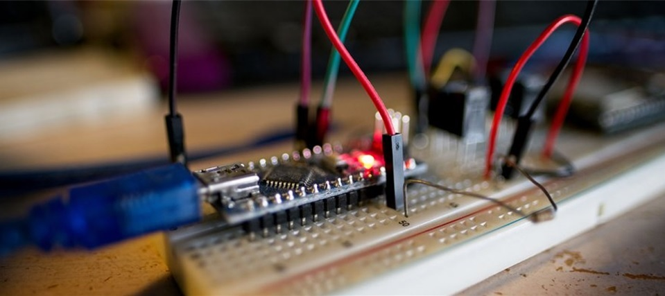

# Internet of Things Incubator

We offer our services as an Internet of Things (IoT) incubator. Our main goal is to facilitate new solutions with IoT technology for businesses, smart cities, Industrial IoT, agriculture, smart home, etc. 

## Services

Our services include: provide a [technical analysis](#technical-analysis) of your idea, build a [proof of concept](#proof-of-concept) for your idea, conduct a [research](#research) project or provide [technical training](#technical-training). 

For more information: [contact us](#contact).

### Technical analysis

Do you have an idea, but aren't sure how to start or even if it's actually technical feasible? 

Let's talk and we'll provide a technical analysis consisting of hardware, software, platforms and alternatives, of your idea. 

### Proof of concept 

We can build a proof of concept for your IoT idea. We prototype our own PCB's and build custom sensor-to-app solutions. 

### Research 

Do you want to collaborate with us on research projects? Our field of expertise includes:

* Low power sensor nodes
* Low power wireless communication
* IoT security
* Edge computing (Artificial Intelligence)
* Sensor-to-app development 

### Technical training

Our courses can be requested on demand. An overview (in Dutch) can be found [here](https://www.vives.be/nl/navormingen-ict). 

## Projects

* [LoRaWAN](https://lorawan-nta.be)
* [Ijsster](https://www.vives.be/nl/nieuws/innovatieve-app-van-vives-en-ijsster-brugge-maakt-dat-je-de-ijskar-niet-meer-misloopt)

## Communities

* [The Things Network](https://www.thethingsnetwork.org/community/bruges/)

## Contact

> <a href="mailto:piet.cordemans@vives.be"> Send us an e-mail</a>  Piet Cordemans   VIVES campus Bruges   Spoorwegstraat 12  8200 Bruges Belgium

## About us

In 2019 [VIVES university college](https://www.vives.be) founded the IoT incubator in order to promote the use of IoT technology in Flanders.